# System Architecture Analysis

## Overview

- **Project**: /home/tom/github/maskservice/redeploy/redeploy
- **Primary Language**: python
- **Languages**: python: 66
- **Analysis Mode**: static
- **Total Functions**: 551
- **Total Classes**: 122
- **Modules**: 66
- **Entry Points**: 397

## Architecture by Module

### cli
- **Functions**: 89
- **File**: `cli.py`

### apply.executor
- **Functions**: 34
- **Classes**: 3
- **File**: `executor.py`

### audit
- **Functions**: 24
- **Classes**: 6
- **File**: `audit.py`

### fleet
- **Functions**: 23
- **Classes**: 6
- **File**: `fleet.py`

### plan.planner
- **Functions**: 21
- **Classes**: 1
- **File**: `planner.py`

### models
- **Functions**: 21
- **Classes**: 20
- **File**: `models.py`

### ssh
- **Functions**: 17
- **Classes**: 4
- **File**: `ssh.py`

### discovery
- **Functions**: 16
- **Classes**: 2
- **File**: `discovery.py`

### observe
- **Functions**: 14
- **Classes**: 3
- **File**: `observe.py`

### version.git_integration
- **Functions**: 13
- **Classes**: 2
- **File**: `git_integration.py`

### iac.base
- **Functions**: 13
- **Classes**: 7
- **File**: `base.py`

### iac.parsers.compose
- **Functions**: 13
- **Classes**: 1
- **File**: `compose.py`

### apply.state
- **Functions**: 13
- **Classes**: 1
- **File**: `state.py`

### detect.workflow
- **Functions**: 12
- **Classes**: 3
- **File**: `workflow.py`

### dsl.loader
- **Functions**: 12
- **Classes**: 3
- **File**: `loader.py`

### patterns
- **Functions**: 11
- **Classes**: 4
- **File**: `patterns.py`

### iac.docker_compose
- **Functions**: 11
- **Classes**: 1
- **File**: `docker_compose.py`

### plugins
- **Functions**: 10
- **Classes**: 2
- **File**: `__init__.py`

### version.changelog
- **Functions**: 10
- **Classes**: 1
- **File**: `changelog.py`

### detect.templates
- **Functions**: 10
- **Classes**: 5
- **File**: `templates.py`

## Key Entry Points

Main execution flows into the system:

### cli.inspect
> Show parsed content of redeploy.css — environments, templates, workflows.

Transparent view of what redeploy reads from the DSL file.
Useful for debug
- **Calls**: cli.command, click.option, Console, dsl.loader.load_css, console.print, console.print, console.print, Path

### iac.docker_compose.DockerComposeParser._parse_service
- **Calls**: cfg.get, iac.docker_compose._env_dict, cfg.get, cfg.get, isinstance, cfg.get, isinstance, cfg.get

### cli.probe
> Autonomously probe one or more hosts — detect SSH credentials, strategy, app.

Tries all available SSH keys (~/.ssh/) and common usernames.
Detects de
- **Calls**: cli.command, click.argument, click.option, click.option, click.option, click.option, click.option, click.option

### cli.version_init
> Initialize .redeploy/version.yaml manifest.
- **Calls**: version_cmd.command, click.option, click.option, click.option, click.option, click.option, Console, Path

### cli.run
> Execute migration from a single YAML spec (source + target in one file).

SPEC defaults to migration.yaml (or value from redeploy.yaml manifest).


E
- **Calls**: cli.command, click.argument, click.option, click.option, click.option, click.option, click.option, click.option

### detect.templates._build_templates
- **Calls**: DetectionTemplate, DetectionTemplate, DetectionTemplate, DetectionTemplate, DetectionTemplate, DetectionTemplate, DetectionTemplate, DetectionTemplate

### cli.exec_multi_cmd
> Execute multiple scripts from markdown codeblocks by reference.

REFS format: comma-separated list of ref ids (markpact:ref or section headings)


Ex
- **Calls**: cli.command, click.argument, click.option, click.option, click.option, click.option, click.option, Console

### cli.audit
> Show deploy audit log from ~/.config/redeploy/audit.jsonl.


Examples:
    redeploy audit
    redeploy audit --last 50 --failed
    redeploy audit --
- **Calls**: cli.command, click.option, click.option, click.option, click.option, click.option, click.option, click.option

### cli.patterns
> List available deploy patterns or show detail for one.


Examples:
    redeploy patterns
    redeploy patterns blue_green
    redeploy patterns canar
- **Calls**: cli.command, click.argument, Console, console.print, Table, t.add_column, t.add_column, t.add_column

### cli.state_cmd
> Inspect or clear resume checkpoints.


Examples:
    redeploy state show migration.yaml      # current checkpoint
    redeploy state clear migration.
- **Calls**: cli.command, click.argument, click.argument, click.option, click.option, Console, ResumeState.load, console.print

### cli.migrate
> Full pipeline: detect → plan → apply.
- **Calls**: cli.command, click.option, click.option, click.option, click.option, click.option, click.option, click.option

### cli.import_cmd
> Parse an IaC/CI-CD file and produce a migration.yaml scaffold.

Auto-detects format from filename. Supports docker-compose.yml (Tier 1).
GitHub Action
- **Calls**: cli.command, click.argument, click.option, click.option, click.option, click.option, click.option, click.option

### cli.export_cmd
> Convert between redeploy.css and redeploy.yaml formats.

Reads the nearest redeploy.css or redeploy.yaml and exports to the
requested format. Useful f
- **Calls**: cli.command, click.option, click.option, click.option, Console, console.print, Path, ProjectManifest.find_css

### cli.exec_cmd
> Execute a script from a markdown codeblock by reference.

REF format: #section-id or ./file.md#section-id or just ref-id (for markpact:ref)

Extracts 
- **Calls**: cli.command, click.argument, click.option, click.option, click.option, click.option, Console, console.print

### cli.plan
> Generate migration-plan.yaml from infra.yaml + target config.
- **Calls**: cli.command, click.option, click.option, click.option, click.option, click.option, click.option, click.option

### cli.version_bump
> Bump version across all sources atomically.

Examples:
    redeploy version bump patch
    redeploy version bump patch --commit --tag --push
    redep
- **Calls**: version_cmd.command, click.argument, click.option, click.option, click.option, click.option, click.option, click.option

### cli.plugin_cmd
> List or inspect registered redeploy plugins.


Examples:
    redeploy plugin list
    redeploy plugin info browser_reload
    redeploy plugin info sy
- **Calls**: cli.command, click.argument, click.argument, Console, plugins.load_user_plugins, registry.names, registry.names, console.print

### cli.version_list
> List all version sources and their values.
- **Calls**: version_cmd.command, click.option, click.option, click.option, Console, Path, VersionManifest.load, cli._resolve_monorepo_targets

### apply.executor.Executor.run
> Execute all steps. Returns True if all passed.
- **Calls**: time.monotonic, logger.info, self._compute_skip_set, enumerate, self._write_audit, self._emitter.start, logger.info, time.monotonic

### cli.diagnose
> Compare a migration spec against the live target host.

Walks the spec (YAML or markpact .md), derives all expected facts
(binaries, directories, port
- **Calls**: cli.command, click.argument, click.option, click.option, click.option, click.option, Console, audit.audit_spec

### iac.docker_compose.DockerComposeParser.parse
- **Calls**: ParsedSpec, self._load_merged, self._load_dotenv, set, services_raw.items, spec.runtime_hints.append, spec.add_warning, data.get

### iac.parsers.compose.DockerComposeParser._parse_service
- **Calls**: ServiceInfo, self._parse_build, self._parse_command, int, self._parse_ports, self._parse_volumes, steps.StepLibrary.list, self._parse_env

### detect.detector.Detector.run
- **Calls**: logger.info, logger.debug, detect.probes.probe_runtime, logger.debug, logger.debug, detect.probes.probe_ports, logger.debug, logger.debug

### dsl_python.runner.PythonMigrationRunner.run_file
> Run a migration from a Python file.

Args:
    file_path: Path to migration.py file
    function_name: Specific function to run (or None for default)

- **Calls**: Path, importlib.util.spec_from_file_location, importlib.util.module_from_spec, spec.loader.exec_module, self._find_migrations, getattr, path.exists, FileNotFoundError

### cli.detect
> Probe infrastructure and produce infra.yaml.

With --workflow: multi-host detection with template scoring.
Reads hosts from redeploy.yaml / redeploy.c
- **Calls**: cli.command, click.option, click.option, click.option, click.option, click.option, click.option, click.option

### cli.workflow_cmd
> Run a named workflow from redeploy.css.


Examples:
    redeploy workflow --list
    redeploy workflow deploy:prod
    redeploy workflow deploy:rpi5 
- **Calls**: cli.command, click.argument, click.option, click.option, click.option, Console, dsl.loader.load_css, next

### cli.init
> Scaffold migration.yaml + redeploy.yaml for this project.


Example:
    redeploy init --host root@1.2.3.4 --app myapp --domain myapp.example.com
   
- **Calls**: cli.command, click.option, click.option, click.option, click.option, click.option, Console, console.print

### cli.scan
> Discover SSH-accessible devices on the local network.

Sources (passive by default, zero packets unless --ping):
  known_hosts  — parse ~/.ssh/known_h
- **Calls**: cli.command, click.option, click.option, click.option, click.option, click.option, click.option, click.option

### cli.version_set
> Set an explicit version across all manifest sources.
- **Calls**: version_cmd.command, click.argument, click.option, click.option, click.option, click.option, click.option, click.option

### plugins.builtin.browser_reload.browser_reload
- **Calls**: plugins.register_plugin, int, bool, ctx.params.get, ctx.probe.run, ctx.params.get, ctx.params.get, StepError

## Process Flows

Key execution flows identified:

### Flow 1: inspect
```
inspect [cli]
  └─ →> load_css
      └─> _build_from_nodes
          └─> _build_manifest
          └─> _build_templates
```

### Flow 2: _parse_service
```
_parse_service [iac.docker_compose.DockerComposeParser]
  └─ →> _env_dict
```

### Flow 3: probe
```
probe [cli]
```

### Flow 4: version_init
```
version_init [cli]
```

### Flow 5: run
```
run [cli]
```

### Flow 6: _build_templates
```
_build_templates [detect.templates]
```

### Flow 7: exec_multi_cmd
```
exec_multi_cmd [cli]
```

### Flow 8: audit
```
audit [cli]
```

### Flow 9: patterns
```
patterns [cli]
```

### Flow 10: state_cmd
```
state_cmd [cli]
```

## Key Classes

### apply.executor.Executor
> Execute MigrationPlan steps on a remote host.
- **Methods**: 25
- **Key Methods**: apply.executor.Executor.__init__, apply.executor.Executor.completed_steps, apply.executor.Executor.state, apply.executor.Executor.state_path, apply.executor.Executor.run, apply.executor.Executor._compute_skip_set, apply.executor.Executor._write_audit, apply.executor.Executor._execute_step, apply.executor.Executor._run_ssh, apply.executor.Executor._run_scp

### plan.planner.Planner
> Generate a MigrationPlan from detected infra + desired target.
- **Methods**: 21
- **Key Methods**: plan.planner.Planner.__init__, plan.planner.Planner.run, plan.planner.Planner._plan_conflict_fixes, plan.planner.Planner._plan_stop_old_services, plan.planner.Planner._plan_deploy_new, plan.planner.Planner._plan_docker_full, plan.planner.Planner._plan_podman_quadlet, plan.planner.Planner._plan_kiosk, plan.planner.Planner._plan_kiosk_appliance, plan.planner.Planner._plan_systemd

### observe.AuditEntry
> Single audit log entry — immutable snapshot of one deployment.
- **Methods**: 18
- **Key Methods**: observe.AuditEntry.__init__, observe.AuditEntry.ts, observe.AuditEntry.host, observe.AuditEntry.app, observe.AuditEntry.from_strategy, observe.AuditEntry.to_strategy, observe.AuditEntry.ok, observe.AuditEntry.elapsed_s, observe.AuditEntry.steps_total, observe.AuditEntry.steps_ok

### ssh.SshClient
> Execute commands on a remote host via SSH (or locally).

Args:
    host:     ``user@ip`` string, or 
- **Methods**: 15
- **Key Methods**: ssh.SshClient.__init__, ssh.SshClient.key, ssh.SshClient.key, ssh.SshClient.run, ssh.SshClient.rsync, ssh.SshClient.scp, ssh.SshClient.put_file, ssh.SshClient.is_reachable, ssh.SshClient.is_ssh_ready, ssh.SshClient.ping

### fleet.Fleet
> Unified first-class fleet — wraps FleetConfig and/or DeviceRegistry.

Provides a single query interf
- **Methods**: 15
- **Key Methods**: fleet.Fleet.__init__, fleet.Fleet.from_file, fleet.Fleet.from_registry, fleet.Fleet.from_config, fleet.Fleet.devices, fleet.Fleet.get, fleet.Fleet.by_tag, fleet.Fleet.by_stage, fleet.Fleet.by_strategy, fleet.Fleet.prod

### version.git_integration.GitIntegration
> Git operations for version management.
- **Methods**: 13
- **Key Methods**: version.git_integration.GitIntegration.__init__, version.git_integration.GitIntegration._run, version.git_integration.GitIntegration.require_clean, version.git_integration.GitIntegration.is_clean, version.git_integration.GitIntegration.get_dirty_files, version.git_integration.GitIntegration.stage_files, version.git_integration.GitIntegration.commit, version.git_integration.GitIntegration.tag, version.git_integration.GitIntegration.push, version.git_integration.GitIntegration.tag_exists

### iac.parsers.compose.DockerComposeParser
> Parser for Docker Compose files (v2 + v3 schema, Compose Spec).
- **Methods**: 13
- **Key Methods**: iac.parsers.compose.DockerComposeParser.can_parse, iac.parsers.compose.DockerComposeParser.parse, iac.parsers.compose.DockerComposeParser._parse_service, iac.parsers.compose.DockerComposeParser._parse_build, iac.parsers.compose.DockerComposeParser._parse_command, iac.parsers.compose.DockerComposeParser._parse_ports, iac.parsers.compose.DockerComposeParser._parse_port_entry, iac.parsers.compose.DockerComposeParser._parse_volumes, iac.parsers.compose.DockerComposeParser._parse_volume_entry, iac.parsers.compose.DockerComposeParser._parse_env

### verify.VerifyContext
> Accumulates check results during verification.
- **Methods**: 11
- **Key Methods**: verify.VerifyContext.check, verify.VerifyContext.add_pass, verify.VerifyContext.add_fail, verify.VerifyContext.add_warn, verify.VerifyContext.add_info, verify.VerifyContext.passed, verify.VerifyContext.failed, verify.VerifyContext.warned, verify.VerifyContext.total, verify.VerifyContext.ok

### apply.executor.ProgressEmitter
> Emits YAML-formatted progress events to a stream (default: stdout).

Each event is a YAML document (
- **Methods**: 11
- **Key Methods**: apply.executor.ProgressEmitter.__init__, apply.executor.ProgressEmitter._ts, apply.executor.ProgressEmitter._elapsed, apply.executor.ProgressEmitter._emit, apply.executor.ProgressEmitter.start, apply.executor.ProgressEmitter.step_start, apply.executor.ProgressEmitter.step_done, apply.executor.ProgressEmitter.step_fail, apply.executor.ProgressEmitter.progress, apply.executor.ProgressEmitter.done

### apply.state.ResumeState
> Checkpoint for a single MigrationPlan execution.
- **Methods**: 10
- **Key Methods**: apply.state.ResumeState.load, apply.state.ResumeState.load_or_new, apply.state.ResumeState.save, apply.state.ResumeState.remove, apply.state.ResumeState.mark_done, apply.state.ResumeState.mark_failed, apply.state.ResumeState.reset, apply.state.ResumeState.is_done, apply.state.ResumeState.completed_count, apply.state.ResumeState.remaining
- **Inherits**: BaseModel

### version.changelog.ChangelogManager
> Manage CHANGELOG.md in keep-a-changelog format.
- **Methods**: 9
- **Key Methods**: version.changelog.ChangelogManager.__init__, version.changelog.ChangelogManager.exists, version.changelog.ChangelogManager.read, version.changelog.ChangelogManager._default_template, version.changelog.ChangelogManager.get_unreleased_section, version.changelog.ChangelogManager.prepare_release, version.changelog.ChangelogManager._format_release_content, version.changelog.ChangelogManager.write, version.changelog.ChangelogManager.preview_release

### models.DeviceRegistry
> Persistent device registry — stored at ~/.config/redeploy/devices.yaml.
- **Methods**: 9
- **Key Methods**: models.DeviceRegistry.get, models.DeviceRegistry.upsert, models.DeviceRegistry.remove, models.DeviceRegistry.by_tag, models.DeviceRegistry.by_strategy, models.DeviceRegistry.reachable, models.DeviceRegistry.default_path, models.DeviceRegistry.load, models.DeviceRegistry.save
- **Inherits**: BaseModel

### audit.AuditReport
- **Methods**: 8
- **Key Methods**: audit.AuditReport.add, audit.AuditReport.passed, audit.AuditReport.failed, audit.AuditReport.warned, audit.AuditReport.skipped, audit.AuditReport.ok, audit.AuditReport.summary, audit.AuditReport.to_dict

### audit._Probe
> Thin wrapper around SshClient with sensible audit timeouts.
- **Methods**: 8
- **Key Methods**: audit._Probe.__init__, audit._Probe.has_binary, audit._Probe.has_path, audit._Probe.port_listening, audit._Probe.has_image, audit._Probe.has_systemd_unit, audit._Probe.apt_package, audit._Probe.disk_free_gib

### version.manifest.VersionManifest
> Root manifest model for .redeploy/version.yaml.
- **Methods**: 8
- **Key Methods**: version.manifest.VersionManifest.load, version.manifest.VersionManifest.save, version.manifest.VersionManifest.format_version, version.manifest.VersionManifest.get_source_paths, version.manifest.VersionManifest.get_package, version.manifest.VersionManifest.list_packages, version.manifest.VersionManifest.is_monorepo, version.manifest.VersionManifest.get_all_package_versions
- **Inherits**: BaseModel

### observe.DeployAuditLog
> Persistent audit log — newline-delimited JSON at ``path``.

Default path: ``~/.config/redeploy/audit
- **Methods**: 7
- **Key Methods**: observe.DeployAuditLog.__init__, observe.DeployAuditLog.record, observe.DeployAuditLog._append, observe.DeployAuditLog.load, observe.DeployAuditLog.tail, observe.DeployAuditLog.filter, observe.DeployAuditLog.clear

### plugins.PluginRegistry
> Central registry mapping plugin_type strings to handler callables.
- **Methods**: 7
- **Key Methods**: plugins.PluginRegistry.__init__, plugins.PluginRegistry.register, plugins.PluginRegistry.__call__, plugins.PluginRegistry.get, plugins.PluginRegistry.names, plugins.PluginRegistry._ensure_builtins, plugins.PluginRegistry.load_directory

### detect.workflow.HostDetectionResult
> Full detection result for a single host.
- **Methods**: 7
- **Key Methods**: detect.workflow.HostDetectionResult.strategy, detect.workflow.HostDetectionResult.environment, detect.workflow.HostDetectionResult.confidence, detect.workflow.HostDetectionResult.template_name, detect.workflow.HostDetectionResult.spec_template, detect.workflow.HostDetectionResult.env_block, detect.workflow.HostDetectionResult.notes

### fleet.FleetDevice
> Generic device descriptor — superset of ``deploy``'s DeviceConfig.

All fields from ``deploy.core.mo
- **Methods**: 7
- **Key Methods**: fleet.FleetDevice.ssh_user, fleet.FleetDevice.ssh_ip, fleet.FleetDevice.is_local, fleet.FleetDevice.is_prod, fleet.FleetDevice.has_tag, fleet.FleetDevice.has_expectation, fleet.FleetDevice.verify_expectations
- **Inherits**: BaseModel

### detect.workflow.WorkflowResult
> Aggregated result across all probed hosts.
- **Methods**: 6
- **Key Methods**: detect.workflow.WorkflowResult.reachable, detect.workflow.WorkflowResult.unreachable, detect.workflow.WorkflowResult.by_env, detect.workflow.WorkflowResult.summary, detect.workflow.WorkflowResult.generated_redeploy_yaml, detect.workflow.WorkflowResult.generated_migration_yaml

## Data Transformation Functions

Key functions that process and transform data:

### parse.parse_docker_ps
> Parse 'docker ps --format "{{.Names}}|{{.Image}}|{{.Status}}|{{.Ports}}|{{.State}}"' output.
- **Output to**: output.split, line.strip, line.split, line.startswith, len

### parse.parse_container_line
> Parse a single NAME|STATUS|IMAGE pipe-delimited container line.
- **Output to**: line.split, len, len

### parse.parse_system_info
> Parse KEY:VALUE system info lines (HOSTNAME, UPTIME, DISK, MEM, LOAD) into a dict.
- **Output to**: output.split, line.strip, line.startswith, line.startswith, line.startswith

### parse.parse_diagnostics
> Parse multi-section SSH diagnostics output into structured dict.

Handles sections: ===SYSTEM===, ==
- **Output to**: output.split, raw_line.strip, line.startswith, parse._apply_system_line, parse.parse_container_line

### parse.parse_health_info
> Parse health-check SSH output (HOSTNAME, UPTIME, HEALTH, DISK, LOAD) into a dict.
- **Output to**: output.split, line.strip, _HEALTH_PREFIXES.items, line.startswith, line.startswith

### markpact.parser.parse_markpact_file
- **Output to**: Path, markpact.parser.parse_markpact_text, file_path.read_text

### markpact.parser.parse_markpact_text
- **Output to**: Path, MarkdownIt, parser.parse, MarkpactDocument, markpact.parser._parse_markpact_fence_info

### markpact.parser._parse_markpact_fence_info
> Parse fence info, returns (kind, format_name, ref_id) or None.

Supports:
- ```yaml markpact:steps
-
- **Output to**: token.startswith, None.split, None.lower, kind_part.startswith, token.lower

### markpact.parser.parse_markpact_file_with_refs
> Parse markpact file and extract all referenced scripts.

Returns:
    (document, refs) where refs is
- **Output to**: Path, file_path.read_text, markpact.parser.parse_markpact_text, MarkdownIt, parser.parse

### version.changelog.ChangelogManager._format_release_content
> Format release content from unreleased section + commits.
- **Output to**: unreleased_content.strip, categories.items, version.commits.parse_conventional, None.join, None.append

### version.sources.base.BaseAdapter._validate_path
> Check if path exists. Returns False only if optional=True.
- **Output to**: path.exists, FileNotFoundError

### cli._format_release_tag
- **Output to**: git_config.tag_format.format

### cli._format_version_scan_source_status
- **Output to**: None.join, parts.append

### iac.docker_compose._parse_port
> Parse a single Compose port entry into PortInfo.
- **Output to**: isinstance, None.strip, s.split, int, raw.get

### iac.docker_compose._parse_volume
> Parse a single Compose volume entry into VolumeInfo.
- **Output to**: isinstance, str, s.split, VolumeInfo, raw.get

### iac.docker_compose.DockerComposeParser.can_parse
- **Output to**: path.name.lower, fnmatch, path.suffix.lower, pat.lower, path.open

### iac.docker_compose.DockerComposeParser.parse
- **Output to**: ParsedSpec, self._load_merged, self._load_dotenv, set, services_raw.items

### iac.docker_compose.DockerComposeParser._parse_service
- **Output to**: cfg.get, iac.docker_compose._env_dict, cfg.get, cfg.get, isinstance

### iac.registry.parse_file
> Parse a single file with auto-detected format.
- **Output to**: parser_registry.parse, Path

### iac.registry.parse_dir
> Parse all recognised files under *root*.
- **Output to**: parser_registry.parse_dir, Path

### dsl.parser.RedeployDSLParser.parse
- **Output to**: dsl.parser._strip_comments, source.split, len, raw.strip, stripped.startswith

### dsl.parser.RedeployDSLParser._parse_props
> Extract key: value; pairs from a block body string.
- **Output to**: re.sub, _PROP_RE.finditer, None.strip, None.strip, m.group

### iac.base.Parser.can_parse
> Return True if this parser can handle *path* (fast check only).

### iac.base.Parser.parse
> Parse *path* and return a ``ParsedSpec``.

Must not raise for recoverable errors — use ``spec.add_wa

### iac.base.ParserRegistry.parser_for
> Return the first parser that claims to handle *path*, or None.
- **Output to**: p.can_parse

## Behavioral Patterns

### recursion__deep_merge
- **Type**: recursion
- **Confidence**: 0.90
- **Functions**: markpact.compiler._deep_merge

### recursion__parse_port
- **Type**: recursion
- **Confidence**: 0.90
- **Functions**: iac.docker_compose._parse_port

### recursion__deep_merge
- **Type**: recursion
- **Confidence**: 0.90
- **Functions**: iac.docker_compose._deep_merge

### recursion_list
- **Type**: recursion
- **Confidence**: 0.90
- **Functions**: dsl_python.decorators.MigrationRegistry.list

### state_machine_Executor
- **Type**: state_machine
- **Confidence**: 0.70
- **Functions**: apply.executor.Executor.__init__, apply.executor.Executor.completed_steps, apply.executor.Executor.state, apply.executor.Executor.state_path, apply.executor.Executor.run

### state_machine_step
- **Type**: state_machine
- **Confidence**: 0.70
- **Functions**: dsl_python.decorators.step.__enter__, dsl_python.decorators.step.__exit__

### state_machine_ResumeState
- **Type**: state_machine
- **Confidence**: 0.70
- **Functions**: apply.state.ResumeState.load, apply.state.ResumeState.load_or_new, apply.state.ResumeState.save, apply.state.ResumeState.remove, apply.state.ResumeState.mark_done

## Public API Surface

Functions exposed as public API (no underscore prefix):

- `cli.inspect` - 67 calls
- `cli.probe` - 56 calls
- `cli.version_init` - 56 calls
- `cli.run` - 55 calls
- `cli.exec_multi_cmd` - 51 calls
- `cli.audit` - 51 calls
- `cli.patterns` - 50 calls
- `cli.state_cmd` - 46 calls
- `cli.migrate` - 43 calls
- `cli.import_cmd` - 43 calls
- `cli.export_cmd` - 42 calls
- `cli.exec_cmd` - 41 calls
- `cli.plan` - 41 calls
- `cli.version_bump` - 39 calls
- `cli.plugin_cmd` - 38 calls
- `cli.version_list` - 38 calls
- `detect.templates.build_context` - 37 calls
- `apply.executor.Executor.run` - 35 calls
- `cli.diagnose` - 34 calls
- `iac.docker_compose.DockerComposeParser.parse` - 33 calls
- `discovery.auto_probe` - 32 calls
- `detect.detector.Detector.run` - 30 calls
- `dsl_python.runner.PythonMigrationRunner.run_file` - 30 calls
- `cli.detect` - 30 calls
- `cli.workflow_cmd` - 30 calls
- `cli.init` - 29 calls
- `cli.scan` - 29 calls
- `cli.version_set` - 29 calls
- `cli.target` - 28 calls
- `plugins.builtin.browser_reload.browser_reload` - 26 calls
- `cli.status` - 26 calls
- `cli.devices` - 26 calls
- `version.commits.analyze_commits` - 25 calls
- `cli.version_current` - 24 calls
- `cli.version_diff` - 24 calls
- `iac.parsers.compose.DockerComposeParser.parse` - 24 calls
- `plugins.builtin.systemd_reload.systemd_reload` - 23 calls
- `dsl.parser.RedeployDSLParser.parse` - 23 calls
- `markpact.parser.extract_script_from_markdown` - 22 calls
- `cli.apply` - 22 calls

## System Interactions

How components interact:

```mermaid
graph TD
    inspect --> command
    inspect --> option
    inspect --> Console
    inspect --> load_css
    inspect --> print
    _parse_service --> get
    _parse_service --> _env_dict
    _parse_service --> isinstance
    probe --> command
    probe --> argument
    probe --> option
    version_init --> command
    version_init --> option
    run --> command
    run --> argument
    run --> option
    _build_templates --> DetectionTemplate
    exec_multi_cmd --> command
    exec_multi_cmd --> argument
    exec_multi_cmd --> option
    audit --> command
    audit --> option
    patterns --> command
    patterns --> argument
    patterns --> Console
    patterns --> print
    patterns --> Table
    state_cmd --> command
    state_cmd --> argument
    state_cmd --> option
```



## Reverse Engineering Guidelines

1. **Entry Points**: Start analysis from the entry points listed above
2. **Core Logic**: Focus on classes with many methods
3. **Data Flow**: Follow data transformation functions
4. **Process Flows**: Use the flow diagrams for execution paths
5. **API Surface**: Public API functions reveal the interface

## Context for LLM

Maintain the identified architectural patterns and public API surface when suggesting changes.