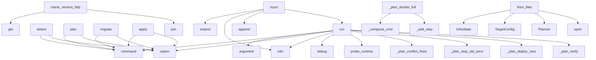

# System Architecture Analysis

## Overview

- **Project**: /home/tom/github/maskservice/redeploy
- **Primary Language**: python
- **Languages**: python: 15, shell: 2
- **Analysis Mode**: static
- **Total Functions**: 83
- **Total Classes**: 24
- **Modules**: 17
- **Entry Points**: 73

## Architecture by Module

### redeploy.plan.planner
- **Functions**: 18
- **Classes**: 1
- **File**: `planner.py`

### redeploy.ssh
- **Functions**: 16
- **Classes**: 4
- **File**: `ssh.py`

### redeploy.apply.executor
- **Functions**: 14
- **Classes**: 2
- **File**: `executor.py`

### redeploy.detect.probes
- **Functions**: 9
- **File**: `probes.py`

### redeploy.cli
- **Functions**: 7
- **File**: `cli.py`

### redeploy.verify
- **Functions**: 7
- **Classes**: 1
- **File**: `verify.py`

### redeploy.version
- **Functions**: 4
- **File**: `version.py`

### redeploy.detect.detector
- **Functions**: 3
- **Classes**: 1
- **File**: `detector.py`

### redeploy.models
- **Functions**: 3
- **Classes**: 15
- **File**: `models.py`

### redeploy.data_sync
- **Functions**: 2
- **File**: `data_sync.py`

## Key Entry Points

Main execution flows into the system:

### redeploy.cli.run
> Execute migration from a single YAML spec (source + target in one file).

SPEC defaults to migration.yaml.


Example:
    redeploy run examples/k3s-t
- **Calls**: cli.command, click.argument, click.option, click.option, click.option, click.option, click.option, Console

### redeploy.cli.detect
> Probe infrastructure and produce infra.yaml.
- **Calls**: cli.command, click.option, click.option, click.option, click.option, Console, Path, console.print

### redeploy.cli.plan
> Generate migration-plan.yaml from infra.yaml + target config.
- **Calls**: cli.command, click.option, click.option, click.option, click.option, click.option, click.option, click.option

### redeploy.cli.migrate
> Full pipeline: detect → plan → apply.
- **Calls**: cli.command, click.option, click.option, click.option, click.option, click.option, click.option, click.option

### redeploy.detect.detector.Detector.run
- **Calls**: logger.info, logger.debug, redeploy.detect.probes.probe_runtime, logger.debug, logger.debug, redeploy.detect.probes.probe_ports, logger.debug, logger.debug

### redeploy.cli.apply
> Execute a migration plan.
- **Calls**: cli.command, click.option, click.option, click.option, click.option, Console, Executor.from_file, console.print

### redeploy.version.check_version_http
> Call ``/api/v3/version/check`` on a running service.

Returns ``(ok, summary_line, full_payload)``.
Compares all service versions (backend/frontend/fi
- **Calls**: payload.get, payload.get, payload.get, payload.get, None.join, base_url.rstrip, urllib.request.Request, urllib.request.urlopen

### redeploy.ssh.SshClient.rsync
> rsync *local_path* to ``host:remote_path``.
- **Calls**: cmd.extend, logger.info, cmd.append, cmd.extend, subprocess.run, SshResult, SshResult, SshResult

### redeploy.plan.planner.Planner.run
- **Calls**: logger.info, self._plan_conflict_fixes, self._plan_stop_old_services, self._plan_deploy_new, self._plan_verify, self._assess_risk, self._estimate_downtime, MigrationPlan

### redeploy.plan.planner.Planner._plan_docker_full
- **Calls**: self._compose_cmd, self._add_step, self._add_step, self._add_step, self._add_step, MigrationStep, MigrationStep, MigrationStep

### redeploy.plan.planner.Planner.from_files
- **Calls**: InfraState, TargetConfig, Planner, infra_path.open, yaml.safe_load, target_path.exists, target_path.open, TargetConfig

### redeploy.ssh.SshClient.run
> Execute *cmd* on the remote host (or locally).
- **Calls**: logger.debug, self._run_local, subprocess.run, SshResult, self._ssh_opts, logger.debug, SshResult, SshResult

### redeploy.apply.executor.Executor.run
> Execute all steps. Returns True if all passed.
- **Calls**: logger.info, logger.info, self._execute_step, self._completed.append, len, logger.error, str, len

### redeploy.plan.planner.Planner._plan_conflict_fixes
- **Calls**: self._add_step, self._add_step, self._add_step, self._notes.append, MigrationStep, MigrationStep, MigrationStep, self._notes.append

### redeploy.plan.planner.Planner._plan_stop_old_services
- **Calls**: self._add_step, self._compose_cmd, self._add_step, any, self._add_step, MigrationStep, MigrationStep, MigrationStep

### redeploy.ssh.SshClient._detect_key
- **Calls**: os.environ.get, Path.home, None.is_file, Path, Path, c.is_file, Path, str

### redeploy.ssh.SshClient.scp
> Copy single file to remote host.
- **Calls**: logger.info, self._scp_opts, subprocess.run, SshResult, logger.warning, SshResult, str

### redeploy.data_sync.collect_sqlite_counts
> Collect row counts for the given SQLite tables under *app_root*.

Returns a flat mapping of ``{table_name: row_count}``. Missing databases or
tables a
- **Calls**: local_db.exists, sqlite3.connect, conn.close, str, None.fetchone, int, conn.execute

### redeploy.verify.verify_data_integrity
> Compare local vs remote SQLite row counts and record results in *ctx*.
- **Calls**: local_counts.items, isinstance, remote_counts.get, local_n.get, ctx.add_fail, ctx.add_fail, ctx.add_pass

### redeploy.apply.executor.Executor._run_http_check
> HTTP check via SSH curl on the remote host (avoids local network/firewall issues).
- **Calls**: range, StepError, StepError, logger.debug, time.sleep, self.probe.run, self.probe.run

### redeploy.ssh.SshClient._run_local
- **Calls**: subprocess.run, SshResult, SshResult, SshResult, str

### redeploy.cli.cli
> redeploy — Infrastructure migration toolkit: detect → plan → apply
- **Calls**: click.group, click.version_option, click.option, redeploy.cli._setup_logging, ctx.ensure_object

### redeploy.verify.VerifyContext.check
> Run a single remote check command and record the result.

*remote* is any object with ``.run(cmd) -> result`` (SshClient family).
- **Calls**: remote.run, self.checks.append, logger.debug, r.stdout.strip, self.errors.append

### redeploy.apply.executor.Executor._rollback
- **Calls**: logger.warning, reversed, logger.info, self.probe.run, logger.warning

### redeploy.plan.planner.Planner._plan_deploy_new
- **Calls**: self._plan_docker_full, self._plan_podman_quadlet, self._plan_systemd, self._notes.append

### redeploy.plan.planner.Planner._plan_verify
- **Calls**: self._add_step, self._add_step, MigrationStep, MigrationStep

### redeploy.plan.planner.Planner._append_extra_steps
> Append manually declared extra_steps from spec after auto-generated ones.
- **Calls**: MigrationStep, self._add_step, self._notes.append, raw.get

### redeploy.plan.planner.Planner.save
- **Calls**: plan.model_dump, output.write_text, logger.info, yaml.dump

### redeploy.detect.detector.Detector.save
- **Calls**: state.model_dump, output.write_text, logger.info, yaml.dump

### redeploy.apply.executor.Executor._execute_step
- **Calls**: logger.info, dispatch.get, handler, StepError

## Process Flows

Key execution flows identified:

### Flow 1: run
```
run [redeploy.cli]
```

### Flow 2: detect
```
detect [redeploy.cli]
```

### Flow 3: plan
```
plan [redeploy.cli]
```

### Flow 4: migrate
```
migrate [redeploy.cli]
```

### Flow 5: apply
```
apply [redeploy.cli]
```

### Flow 6: check_version_http
```
check_version_http [redeploy.version]
```

### Flow 7: rsync
```
rsync [redeploy.ssh.SshClient]
```

### Flow 8: _plan_docker_full
```
_plan_docker_full [redeploy.plan.planner.Planner]
```

### Flow 9: from_files
```
from_files [redeploy.plan.planner.Planner]
```

### Flow 10: _plan_conflict_fixes
```
_plan_conflict_fixes [redeploy.plan.planner.Planner]
```

## Key Classes

### redeploy.plan.planner.Planner
> Generate a MigrationPlan from detected infra + desired target.
- **Methods**: 18
- **Key Methods**: redeploy.plan.planner.Planner.__init__, redeploy.plan.planner.Planner.run, redeploy.plan.planner.Planner._plan_conflict_fixes, redeploy.plan.planner.Planner._plan_stop_old_services, redeploy.plan.planner.Planner._plan_deploy_new, redeploy.plan.planner.Planner._plan_docker_full, redeploy.plan.planner.Planner._plan_podman_quadlet, redeploy.plan.planner.Planner._plan_systemd, redeploy.plan.planner.Planner._plan_verify, redeploy.plan.planner.Planner._compose_cmd

### redeploy.ssh.SshClient
> Execute commands on a remote host via SSH (or locally).

Args:
    host:     ``user@ip`` string, or 
- **Methods**: 14
- **Key Methods**: redeploy.ssh.SshClient.__init__, redeploy.ssh.SshClient.key, redeploy.ssh.SshClient.key, redeploy.ssh.SshClient.run, redeploy.ssh.SshClient.rsync, redeploy.ssh.SshClient.scp, redeploy.ssh.SshClient.is_reachable, redeploy.ssh.SshClient.is_ssh_ready, redeploy.ssh.SshClient.ping, redeploy.ssh.SshClient._run_local

### redeploy.apply.executor.Executor
> Execute MigrationPlan steps on a remote host.
- **Methods**: 13
- **Key Methods**: redeploy.apply.executor.Executor.__init__, redeploy.apply.executor.Executor.run, redeploy.apply.executor.Executor._execute_step, redeploy.apply.executor.Executor._run_ssh, redeploy.apply.executor.Executor._run_scp, redeploy.apply.executor.Executor._run_rsync, redeploy.apply.executor.Executor._run_http_check, redeploy.apply.executor.Executor._run_version_check, redeploy.apply.executor.Executor._run_wait, redeploy.apply.executor.Executor._rollback

### redeploy.verify.VerifyContext
> Accumulates check results during verification.
- **Methods**: 11
- **Key Methods**: redeploy.verify.VerifyContext.check, redeploy.verify.VerifyContext.add_pass, redeploy.verify.VerifyContext.add_fail, redeploy.verify.VerifyContext.add_warn, redeploy.verify.VerifyContext.add_info, redeploy.verify.VerifyContext.passed, redeploy.verify.VerifyContext.failed, redeploy.verify.VerifyContext.warned, redeploy.verify.VerifyContext.total, redeploy.verify.VerifyContext.ok

### redeploy.ssh.RemoteExecutor
> Thin wrapper kept for deploy.core compatibility.

``RemoteExecutor(device)``  →  ``SshClient(host, p
- **Methods**: 4
- **Key Methods**: redeploy.ssh.RemoteExecutor.__init__, redeploy.ssh.RemoteExecutor.ssh_target, redeploy.ssh.RemoteExecutor.ssh_opts, redeploy.ssh.RemoteExecutor.scp_opts
- **Inherits**: SshClient

### redeploy.detect.detector.Detector
> Probe infrastructure and produce InfraState.
- **Methods**: 3
- **Key Methods**: redeploy.detect.detector.Detector.__init__, redeploy.detect.detector.Detector.run, redeploy.detect.detector.Detector.save

### redeploy.ssh.SshResult
- **Methods**: 3
- **Key Methods**: redeploy.ssh.SshResult.ok, redeploy.ssh.SshResult.success, redeploy.ssh.SshResult.out

### redeploy.ssh.RemoteProbe
> Thin wrapper kept for redeploy.detect compatibility.

``RemoteProbe(host)``  →  ``SshClient(host)``
- **Methods**: 3
- **Key Methods**: redeploy.ssh.RemoteProbe.__init__, redeploy.ssh.RemoteProbe.is_local, redeploy.ssh.RemoteProbe.is_local
- **Inherits**: SshClient

### redeploy.models.MigrationSpec
> Single YAML file describing full migration: from-state → to-state.

Usage:
    redeploy run --spec m
- **Methods**: 3
- **Key Methods**: redeploy.models.MigrationSpec.from_file, redeploy.models.MigrationSpec.to_infra_state, redeploy.models.MigrationSpec.to_target_config
- **Inherits**: BaseModel

### redeploy.apply.executor.StepError
- **Methods**: 1
- **Key Methods**: redeploy.apply.executor.StepError.__init__
- **Inherits**: Exception

### redeploy.models.ConflictSeverity
- **Methods**: 0
- **Inherits**: str, Enum

### redeploy.models.StepAction
- **Methods**: 0
- **Inherits**: str, Enum

### redeploy.models.StepStatus
- **Methods**: 0
- **Inherits**: str, Enum

### redeploy.models.DeployStrategy
- **Methods**: 0
- **Inherits**: str, Enum

### redeploy.models.ServiceInfo
- **Methods**: 0
- **Inherits**: BaseModel

### redeploy.models.PortInfo
- **Methods**: 0
- **Inherits**: BaseModel

### redeploy.models.ConflictInfo
- **Methods**: 0
- **Inherits**: BaseModel

### redeploy.models.RuntimeInfo
- **Methods**: 0
- **Inherits**: BaseModel

### redeploy.models.AppHealthInfo
- **Methods**: 0
- **Inherits**: BaseModel

### redeploy.models.InfraState
> Full detected state of infrastructure — output of `detect`.
- **Methods**: 0
- **Inherits**: BaseModel

## Data Transformation Functions

Key functions that process and transform data:

## Public API Surface

Functions exposed as public API (no underscore prefix):

- `redeploy.cli.run` - 48 calls
- `redeploy.cli.detect` - 43 calls
- `redeploy.cli.plan` - 41 calls
- `redeploy.cli.migrate` - 41 calls
- `redeploy.detect.detector.Detector.run` - 30 calls
- `redeploy.cli.apply` - 22 calls
- `redeploy.detect.probes.probe_docker_services` - 17 calls
- `redeploy.detect.probes.probe_runtime` - 15 calls
- `redeploy.version.check_version_http` - 14 calls
- `redeploy.detect.probes.detect_conflicts` - 12 calls
- `redeploy.ssh.SshClient.rsync` - 11 calls
- `redeploy.detect.probes.probe_ports` - 11 calls
- `redeploy.plan.planner.Planner.run` - 10 calls
- `redeploy.detect.probes.probe_k3s_services` - 10 calls
- `redeploy.detect.probes.probe_systemd_services` - 10 calls
- `redeploy.plan.planner.Planner.from_files` - 9 calls
- `redeploy.ssh.SshClient.run` - 9 calls
- `redeploy.detect.probes.probe_health` - 9 calls
- `redeploy.apply.executor.Executor.run` - 9 calls
- `redeploy.ssh.SshClient.scp` - 7 calls
- `redeploy.data_sync.collect_sqlite_counts` - 7 calls
- `redeploy.verify.verify_data_integrity` - 7 calls
- `redeploy.cli.cli` - 5 calls
- `redeploy.verify.VerifyContext.check` - 5 calls
- `redeploy.detect.probes.probe_iptables_dnat` - 5 calls
- `redeploy.plan.planner.Planner.save` - 4 calls
- `redeploy.detect.detector.Detector.save` - 4 calls
- `redeploy.apply.executor.Executor.from_file` - 4 calls
- `redeploy.apply.executor.Executor.save_results` - 4 calls
- `redeploy.models.MigrationSpec.from_file` - 4 calls
- `redeploy.plan.planner.Planner.from_spec` - 3 calls
- `redeploy.ssh.SshClient.ping` - 3 calls
- `redeploy.data_sync.rsync_timeout_for_path` - 3 calls
- `redeploy.version.read_local_version` - 3 calls
- `redeploy.version.read_remote_version` - 3 calls
- `redeploy.apply.executor.Executor.summary` - 3 calls
- `redeploy.verify.VerifyContext.add_fail` - 2 calls
- `redeploy.models.MigrationSpec.to_infra_state` - 2 calls
- `redeploy.ssh.SshClient.is_reachable` - 1 calls
- `redeploy.ssh.SshClient.is_ssh_ready` - 1 calls

## System Interactions

How components interact:



## Reverse Engineering Guidelines

1. **Entry Points**: Start analysis from the entry points listed above
2. **Core Logic**: Focus on classes with many methods
3. **Data Flow**: Follow data transformation functions
4. **Process Flows**: Use the flow diagrams for execution paths
5. **API Surface**: Public API functions reveal the interface

## Context for LLM

Maintain the identified architectural patterns and public API surface when suggesting changes.